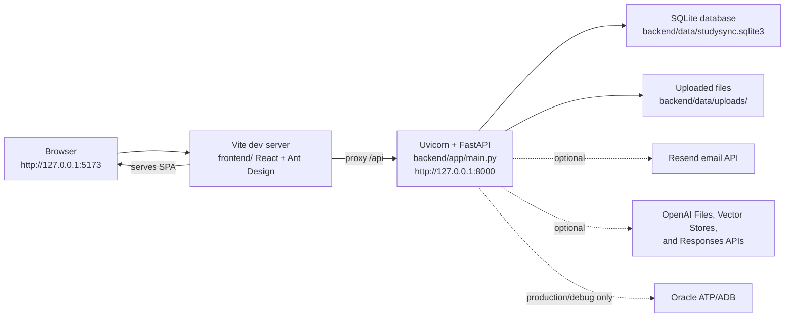
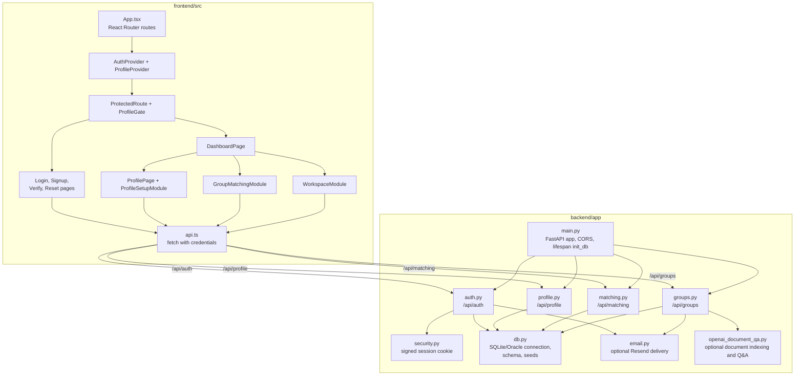
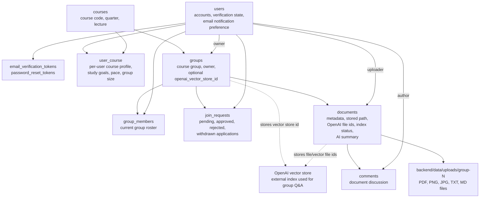

# StudySync

StudySync is a CS 35L study group collaboration app. It includes UCLA-email
authentication, profile setup, study group matching, join request workflows, and
shared group workspaces for uploading, searching, previewing, discussing, and
asking AI-assisted questions about study materials.

## Local Prerequisites

- Python 3.11 or newer
- `uv` for backend dependency management
- Node.js and npm for the Vite/React frontend

Run the backend and frontend in two separate terminals from the repository root.

## Run Locally

### 1. Start The Backend API

```sh
cd backend
uv sync --dev
uv run uvicorn app.main:app --reload --host 127.0.0.1 --port 8000
```

The API should answer:

```sh
curl http://127.0.0.1:8000/api/health
```

Expected response:

```json
{"status":"ok"}
```

On startup, FastAPI runs `init_db()`. Local development uses SQLite by default,
creates `backend/data/studysync.sqlite3` if it does not exist, creates or
migrates the required tables, and seeds mock course/group workspace data.
Uploaded files are stored under `backend/data/uploads/`.

### 2. Start The Frontend

```sh
cd frontend
npm ci
npm run dev -- --host 127.0.0.1 --port 5173
```

Then open:

```text
http://127.0.0.1:5173
```

The Vite dev server proxies frontend `/api` requests to
`http://127.0.0.1:8000`, as configured in `frontend/vite.config.ts`, so
`VITE_API_BASE_URL` is not required for the normal local setup. The backend CORS
configuration currently allows the default Vite origins on port `5173`, so keep
that port unless you also update the backend CORS settings or continue to route
API calls through Vite's proxy.

## Local Configuration

The app runs locally without production secrets. These environment variables are
useful when you need to override defaults:

| Variable | Used by | Local behavior |
| --- | --- | --- |
| `STUDYSYNC_SECRET_KEY` | backend sessions | Defaults to a development key. Set this if you want stable local cookies across secret changes. |
| `STUDYSYNC_DB_PATH` | backend database | Defaults to `backend/data/studysync.sqlite3`. |
| `STUDYSYNC_DB_BACKEND` | backend database | Defaults to `auto`, which selects SQLite locally. Use `sqlite` to force local SQLite. |
| `STUDYSYNC_FRONTEND_URL` | backend email links | Defaults to `http://localhost:5173`. Set to `http://127.0.0.1:5173` if you use that host in links. |
| `RESEND_API_KEY` | backend email | Optional. If unset, verification, reset, and group application emails are skipped in logs. |
| `RESEND_FROM_EMAIL` | backend email | Optional sender address for Resend. |
| `OPENAI_API_KEY` | document Q&A | Optional. If unset, uploads still work, but OpenAI indexing/Q&A is unavailable. |
| `OPENAI_DOC_QA_ENABLED` | document Q&A | Optional. Set to `0` or `false` to disable document Q&A even when an API key is present. |
| `OPENAI_DOC_QA_MODEL` | document Q&A | Optional model override. Defaults in `backend/app/config.py`. |
| `VITE_API_BASE_URL` | frontend API client | Leave unset for the Vite proxy. Set only if the browser should call the API directly. |

Oracle Autonomous Database support is present for OCI production or explicit
debugging, but it is not needed for local development. The backend switches to
Oracle only when environment variables such as `STUDYSYNC_RUNTIME_ENV=oci`,
`STUDYSYNC_DB_DEBUG=atp`, `STUDYSYNC_USE_ORACLE_ADB=1`, or
`STUDYSYNC_DB_BACKEND=oracle` are set. See
[backend/README.md](backend/README.md#database-mode) for the Oracle-specific
variables.

To reset local data, stop the backend and remove the local SQLite database file
and any uploaded files under `backend/data/`. The next backend startup will
recreate the schema and seed data.

## Run Tests And Checks

Backend:

```sh
cd backend
uv run pytest
```

Frontend:

```sh
cd frontend
npm test
npm run build
```

## Architecture

### Local Runtime Topology



### Frontend And API Module Map



### Core Data And Workspace Flow



## Feature Notes

- Authentication stores an HTTP-only signed `studysync_session` cookie.
- Signup requires a UCLA email address. If `RESEND_API_KEY` is not configured,
  email delivery is skipped, but local account creation still succeeds.
- The profile flow stores one or more course preferences in `user_course`.
- Matching reads profile preferences and existing group membership/request state.
- Group workspaces allow supported files up to 50 MB each, with a 2 GB per-group
  storage cap.
- Document Q&A is optional. Without OpenAI configuration, document upload and
  comments still work, but indexing/Q&A responses report that the feature is not
  available or that no indexed documents are ready.

## Additional Documentation

- [Backend database mode](backend/README.md#database-mode)
- [Part 4 workspace module](docs/part4-workspace.md)
